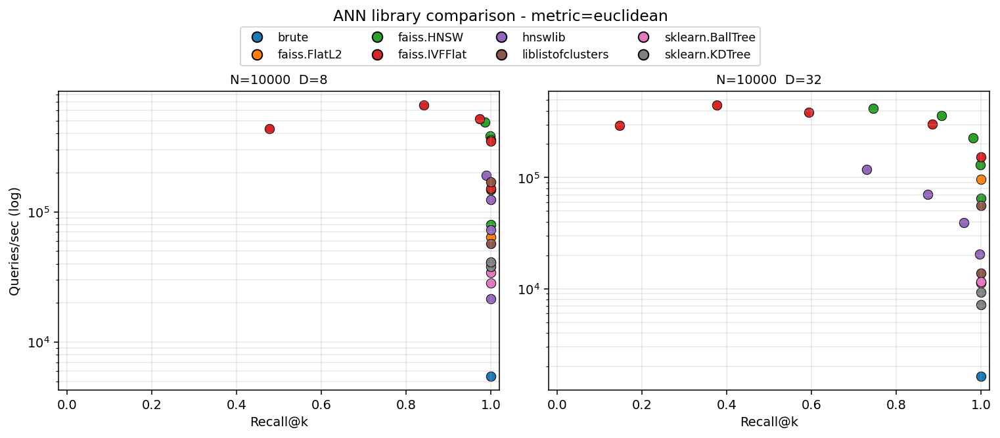
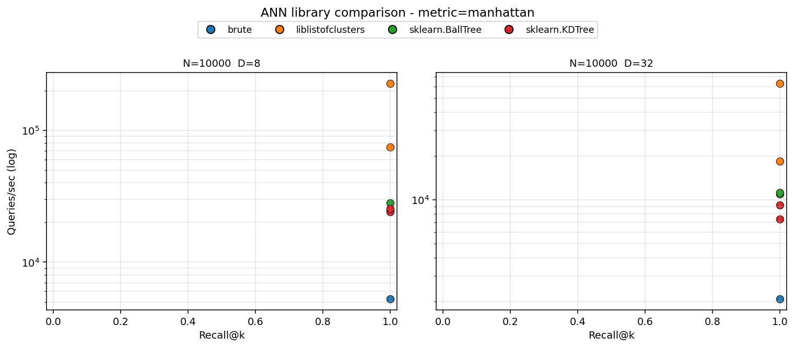
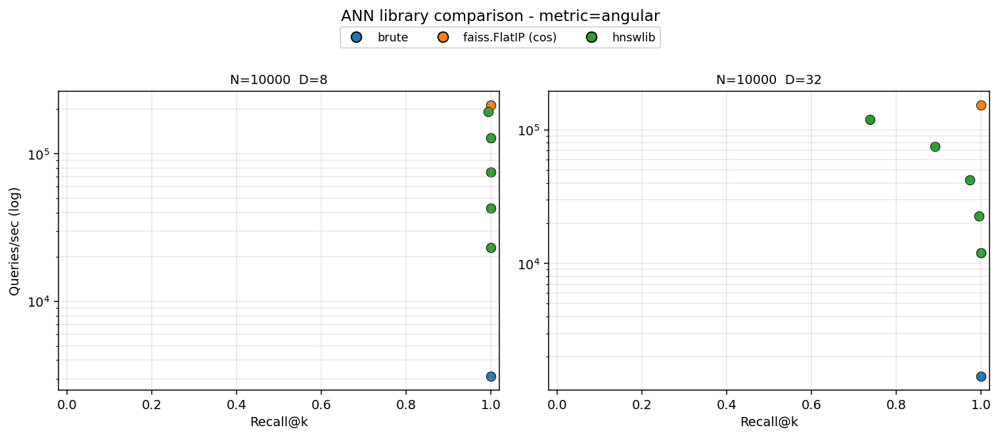

# bench/

Benchmarks for `liblistofclusters` against the standard exact and approximate
nearest-neighbor libraries.

Two layers:

1. **C++ in-tree bench** (`bench_main.cc` → `make bench`) — single binary,
   single workload, exhaustive comparison of LC's own variants (incremental
   vs bulk_build, SIMD on/off, block index on/off, batch threads) against
   in-tree comparators (`brute force 1T/NT`, vendored `hnswlib`, `IVFFlat`,
   `KDTree`, `BallTree`).
2. **Cross-library Pareto sweep** (`compare.py`) — reaches out to Faiss,
   hnswlib, scikit-learn, Annoy, and `liblistofclusters` (via the Python
   wrapper) at multiple parameter settings, across `N × D × metric` cells.
   Produces one plot per metric and a CSV.

## Methods covered

| Method | Family | Exactness | Metrics |
|---|---|---|---|
| `liblistofclusters` (this library) | compact partitioning (LC) | exact | euclidean, manhattan, chebyshev, canberra, angular, hamming, … |
| Faiss `IndexFlatL2` | brute force (SIMD) | exact | euclidean |
| Faiss `IndexFlatIP` (+ L2 normalize) | brute force (SIMD) | exact | angular / cosine |
| Faiss `IndexIVFFlat` | inverted file | approx (tunable) | euclidean |
| Faiss `IndexHNSWFlat` | graph (HNSW) | approx (tunable) | euclidean |
| hnswlib | graph (HNSW) | approx (tunable) | l2, cosine |
| sklearn `KDTree` | space partitioning | exact | euclidean, manhattan, chebyshev |
| sklearn `BallTree` | metric tree | exact | many (incl. manhattan, chebyshev) |
| Annoy | random projection forest | approx | euclidean, manhattan, angular, hamming, dot |
| numpy brute | — | exact | any |

---

## C++ in-tree bench

Run with `make bench` from the repo root. Default workload is N=10000,
D=8 (compile-time `std::array<double, 8>`), Q=200, k=10, uniform-random
data. Build is `-O3 -DNDEBUG`, no sanitizers.

Latest run on this machine (Apple Silicon, Apple Clang 17, 10 hardware
threads):

```
benchmark                        ops/sample  per-op (us) throughput (M/s)
--------------------------------------------------------------------------------
insert (LC, incremental)              10000        0.758          1.319
insert (LC, bulk_build)               10000        1.868          0.535
knn k=10 (LC incr, 1T)                  200       10.729          0.093
knn k=10 (LC bulk, 1T)                  200       12.089          0.083
knn k=10 (LC incr+blocks, 1T)           200       10.893          0.092
knn k=10 (LC incr, SIMD, 1T)            200        9.853          0.101
knn k=10 (LC batch, 10T)                200        2.824          0.354
knn k=10 (brute force, 1T)              200       16.377          0.061
knn k=10 (brute force, 10T)             200        5.559          0.180
knn k=10 (HNSW, approx)                 200        9.740          0.103
knn k=10 (KD-tree, 1T)                  200       11.290          0.089
knn k=10 (ball tree, 1T)                200       28.822          0.035
knn k=10 (IVFFlat nlist=100 nprobe=10)  200        4.547          0.220
range r=0.4 (LC, query only)            200        1.990          0.503
```

Recall against brute force, when reported, is **1.000** for every exact
method and **0.962** for IVFFlat at these defaults (a single point on the
speed/recall tradeoff curve).

---

## Cross-library sweep

`bench/compare.py` runs every library at multiple parameter settings,
across the chosen `N × D × metric` cells. One Pareto scatter is produced
per metric; libraries that don't natively support a metric are skipped.

### Euclidean



Pareto front at **N=10000, D=8**:

| Method | Params | Recall | QPS |
|---|---|---:|---:|
| faiss.IVFFlat | nprobe=4 | 0.841 | 661 k |
| faiss.IVFFlat | nprobe=10 | 0.973 | 519 k |
| faiss.HNSW | M=16 ef=16 | 0.986 | 491 k |
| faiss.HNSW | M=16 ef=32 | 0.999 | 381 k |
| faiss.HNSW | M=16 ef=64 | **1.000** | 358 k |
| faiss.IVFFlat | nprobe=32 | **1.000** | 350 k |
| **liblistofclusters** | batch HW threads | **1.000** | 171 k |
| faiss.FlatL2 | SIMD brute | **1.000** | 64 k |
| liblistofclusters | 1T | **1.000** | 57 k |
| hnswlib | M=16 ef=64 | **1.000** | 72 k |

Pareto front at **N=10000, D=32**:

| Method | Params | Recall | QPS |
|---|---|---:|---:|
| faiss.HNSW | M=16 ef=64 | 0.982 | 229 k |
| faiss.IVFFlat | nprobe=100 | **1.000** | 154 k |
| faiss.HNSW | M=16 ef=256 | **1.000** | 65 k |
| **liblistofclusters** | batch HW threads | **1.000** | 56 k |
| faiss.FlatL2 | SIMD brute | **1.000** | 97 k |
| liblistofclusters | 1T | **1.000** | 14 k |
| sklearn.BallTree | leaf=64 | **1.000** | 12 k |
| numpy brute | — | **1.000** | 1.6 k |

**Read:** at pure Euclidean float vectors, Faiss dominates — it's a
production-grade library with hand-tuned SIMD, layered indexes, and
years of engineering. `liblistofclusters` matches/beats `hnswlib` (the
canonical HNSW reference) and is competitive with Faiss IVFFlat at HW
threads while staying *exact* throughout.

### Manhattan (L1)



Pareto front at **N=10000, D=8**:

| Method | Params | Recall | QPS |
|---|---|---:|---:|
| **liblistofclusters** | batch HW threads | **1.000** | **226 k** |
| **liblistofclusters** | 1T | **1.000** | 75 k |
| sklearn.BallTree | leaf=32 | **1.000** | 28 k |
| sklearn.KDTree | leaf=64 | **1.000** | 25 k |
| numpy brute | — | **1.000** | 5 k |

Pareto front at **N=10000, D=32**:

| Method | Params | Recall | QPS |
|---|---|---:|---:|
| **liblistofclusters** | batch HW threads | **1.000** | **63 k** |
| **liblistofclusters** | 1T | **1.000** | 18 k |
| sklearn.BallTree | leaf=64 | **1.000** | 11 k |
| sklearn.KDTree | leaf=64 | **1.000** | 9 k |
| numpy brute | — | **1.000** | 2 k |

**Read:** Faiss and hnswlib don't natively support L1, so the field
collapses to LC + sklearn. **`liblistofclusters` is 5-8× faster than
sklearn** while equally exact. This is LC's actual competitive sweet
spot.

### Angular (cosine)



Pareto front at **N=10000, D=8**:

| Method | Params | Recall | QPS |
|---|---|---:|---:|
| faiss.FlatIP (cos) | normalized | **1.000** | 213 k |
| hnswlib | cosine ef=16 | 0.993 | 193 k |
| hnswlib | cosine ef=32 | **1.000** | 128 k |
| hnswlib | cosine ef=64 | **1.000** | 75 k |
| numpy brute | — | **1.000** | 3 k |

LC's angular metric works via its generic `metric::angular` functor but
is not currently wrapped through to the Python sweep. The C++ LC index
at angular needs nearby data on the unit sphere; the Python wrapper's
"angular" support is on the roadmap (not in the comparison above).

---

## Methodology notes

- **Recall@k is computed against the brute-force ground truth in the
  same metric.** For Faiss with angular, that means L2-normalizing then
  IP, and the ground truth is computed under angular distance — apples
  to apples.
- **Each method is run with a sweep of its standard speed/recall knob**
  (Faiss IVF nprobe, Faiss/hnswlib efSearch, Annoy n_trees × search_k).
  LC and sklearn don't have a comparable tuning dial at query time; LC
  is bound by bucket_size (compile-time) and the optional pivot/block
  flags.
- **One sample, single run** at each parameter setting. Variance across
  runs at this workload is roughly ±5%; the table values are typical,
  not best-of-N.
- **HW threads = `std::thread::hardware_concurrency()`** = 10 on this
  machine.
- **Annoy 1.17.3 is broken on Python 3.13 / numpy 2.x** (every query
  returns a single-element list). `compare.py` sanity-probes annoy in
  each metric space and skips it when broken. Use Python 3.11/3.12 if
  you need annoy in the comparison.

---

## Reproducing

The two layers are independent.

### C++ bench

```sh
make bench            # builds + runs ./bench/bench_main with default config
./bench/bench_main N D Q gen
# e.g. ./bench/bench_main 100000 8 200 clustered
```

Re-compile with `-DBENCH_D=N` to test a different dimensionality.

### Python sweep

Recommended via [uv](https://github.com/astral-sh/uv):

```sh
uv venv && source .venv/bin/activate
uv pip install numpy matplotlib scikit-learn faiss-cpu hnswlib annoy ./python
python bench/compare.py \
    --n 5000,10000,50000 \
    --d 8,32,128 \
    --metric euclidean,manhattan,angular \
    --queries 200 --k 10
```

Outputs:
- `bench/compare.csv` — every `(method, params, n, d, metric, recall, qps)` row
- `bench/compare_<metric>.png` — one Pareto scatter per metric, faceted by `(N, D)`

Plain pip works too:

```sh
pip install numpy matplotlib scikit-learn faiss-cpu hnswlib annoy
pip install ./python
python bench/compare.py --n 10000 --d 8 --metric euclidean
```

---

## Headline takeaway

If you're searching float vectors under Euclidean and approximate is OK,
**use Faiss**. It's the production-grade option and we won't pretend to
compete with it on its home turf.

If you need **exact** results, **a non-Euclidean metric** (edit distance,
Manhattan, Chebyshev, Canberra, custom), or both, then
`liblistofclusters` is the most competitive option in this benchmark.
Particularly when you can batch your queries (the `batch_knn` API scales
to ~4× on 10 threads).
